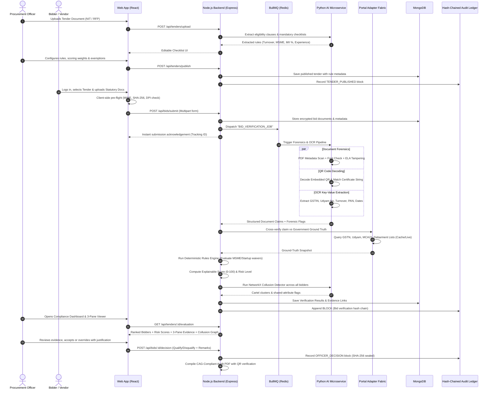

# PRAMAN (प्रमाण) : Next-Gen AI-Powered Statutory Verification, Forensics & Cartel Detection Platform for GeM & Public Procurement

> **Comprehensive System Design, Technical Specification, and MERN Implementation Blueprint**  
> *Developed for SIH Problem Statement: Automated Verification of Statutory, Regulatory & Eligibility Requirements of Bidders on GeM / CPPP / CPSU Portals.*

---

## 📑 Executive Table of Contents

1. [Project Overview & Problem Statement Deep Dive](#1-project-overview--problem-statement-deep-dive)
2. [High-Level System Architecture & Flowchart](#2-high-level-system-architecture--flowchart)
3. [Key Unique Selling Propositions (USPs)](#3-key-unique-selling-propositions-usps)
4. [Technology Stack (MERN + AI Microservice Fabric)](#4-technology-stack-mern--ai-microservice-fabric)
5. [End-to-End System Workflows & User Journeys](#5-end-to-end-system-workflows--user-journeys)
6. [Database Schema Architecture (MongoDB / Mongoose)](#6-database-schema-architecture-mongodb--mongoose)
7. [Module-by-Module Technical Specification (Kya Banega & Kaise Banega)](#7-module-by-module-technical-specification-kya-banega--kaise-banega)
   - [7.1 Tender Ingestion & Rule Checklist Engine](#71-tender-ingestion--rule-checklist-engine)
   - [7.2 Bidder Portal & Smart Upload Pre-Flight](#72-bidder-portal--smart-upload-pre-flight)
   - [7.3 Document Intelligence & OCR Extraction Pipeline](#73-document-intelligence--ocr-extraction-pipeline)
   - [7.4 Forensic Analysis & Tampering Detection Engine](#74-forensic-analysis--tampering-detection-engine)
   - [7.5 Portal Adapter Fabric (Government APIs & Mocks)](#75-portal-adapter-fabric-government-apis--mocks)
   - [7.6 Deterministic Compliance & Explainable Scoring Engine](#76-deterministic-compliance--explainable-scoring-engine)
   - [7.7 Cartel, Proxy & Collusion Graph Detection Engine](#77-cartel-proxy--collusion-graph-detection-engine)
   - [7.8 3-Pane Evidence Comparison Viewer](#78-3-pane-evidence-comparison-viewer)
   - [7.9 Hash-Chained Append-Only Audit Ledger](#79-hash-chained-append-only-audit-ledger)
   - [7.10 Local Air-Gapped Officer AI Assistant (RAG Chatbot)](#710-local-air-gapped-officer-ai-assistant-rag-chatbot)
8. [REST & WebSocket API Contracts](#8-rest--websocket-api-contracts)
9. [Production-Ready Code Blueprints](#9-production-ready-code-blueprints)
   - [9.1 Hash-Chained Cryptographic Audit Ledger (`auditLedger.js`)](#91-hash-chained-cryptographic-audit-ledger-auditledgerjs)
   - [9.2 Cartel & Collusion Graph Analysis Engine (`collusion_detector.py`)](#92-cartel--collusion-graph-analysis-engine-collusion_detectorpy)
   - [9.3 Forensic Metadata & Tampering Scanner (`forensic_scanner.py`)](#93-forensic-metadata--tampering-scanner-forensic_scannerpy)
   - [9.4 React 3-Pane Evidence Verification Component (`ThreePaneViewer.jsx`)](#94-react-3-pane-evidence-verification-component-threepaneviewerjsx)
   - [9.5 Express Background Verification Pipeline (`verificationQueue.js`)](#95-express-background-verification-pipeline-verificationqueuejs)
10. [Repository Directory & Monorepo Structure](#10-repository-directory--monorepo-structure)
11. [Step-by-Step Implementation Roadmap (21-Day Sprint)](#11-step-by-step-implementation-roadmap-21-day-sprint)
12. [Security, Governance & CAG Compliance Standards](#12-security-governance--cag-compliance-standards)

---

## 1. Project Overview & Problem Statement Deep Dive

### 1.1 The Problem Context
Government e-Marketplace (GeM) and Central Public Procurement Portal (CPPP) handle public procurements worth hundreds of thousands of crores annually. Every tender requires procurement officers (POs) to manually review and verify a labyrinth of statutory, financial, technical, and regulatory compliance documents submitted by dozens of competing bidders.

Current manual processes suffer from critical vulnerabilities:
1. **Massive Evaluation Delays**: Manual scrutiny takes 3 to 6 weeks per tender, stalling critical public works and capital expenditure.
2. **Human Fatigue & Inconsistent Verification**: Manual checking of 15+ certificates per bidder (GST returns, Udyam, PAN, ITR, EPFO, ESIC, OEM authorizations, debarment affidavits) leads to inadvertent oversights.
3. **Sophisticated Forgery & Document Tampering**: Bidders manipulate PDF certificates (e.g., Photoshop-modified turnover figures, edited dates on expired GST filings, forged OEM authorization letters).
4. **Bidder Cartelization & Syndicate Bidding**: Shell companies sharing common directors, identical addresses, shared phone numbers, or common bank accounts collude to rig public tenders and extract inflated quotes without detection.
5. **Lack of Legally Verifiable Audit Trails**: Disqualification disputes often lead to protracted litigation in High Courts because verification notes lack cryptographic proof of state-at-time-of-evaluation.

### 1.2 The PRAMAN Solution
**PRAMAN (प्रमाण)** is an autonomous, explainable, and forensics-backed AI verification platform built on the **MERN Stack** (MongoDB, Express, React, Node.js) paired with a high-performance **Python AI/Forensics Microservice**. 

PRAMAN acts as an intelligent co-pilot for Procurement Officers:
- **Reduces verification turnaround by 60% to 80%**.
- **Performs multi-layer document forensics** (PDF metadata anomalies, font mismatch, QR cryptographic verification, ELA image analysis).
- **Validates claims against ground-truth government registries** (GSTN, Udyam, PAN/IT, MCA21, EPFO, GeM Debarment).
- **Detects hidden collusion rings** using graph theory and network clustering.
- **Presents evidence inside an intuitive 3-Pane Viewer** (Original Document Image with Bounding Boxes vs Extracted JSON vs Live Portal Snapshot).
- **Maintains a SHA-256 Hash-Chained Append-Only Audit Ledger** that is CAG (Comptroller and Auditor General) ready.

---

## 2. High-Level System Architecture & Flowchart

The system is architected across three synchronized tiers: **Data & Bidder Layer**, **AI Verification Platform**, and **Operations & Governance Layer**.

```
+----------------------------------------------------------------------------------------------------+
|                                    PRAMAN SYSTEM ARCHITECTURE                                      |
+------------------------------------+----------------------------------+----------------------------+
| 1. DATA & BIDDER LAYER             | 2. AI VERIFICATION PLATFORM      | 3. OPERATIONS & GOVERNANCE |
+------------------------------------+----------------------------------+----------------------------+
|                                    |                                  |                            |
|  +------------------------------+  |  +----------------------------+  |  +----------------------+  |
|  |        Bidder Portal         |  |  |    Document Intelligence   |  |  |  Procurement Officer |  |
|  |    (Consent + Bid Upload)    |  |  |  (OCR - Classify - Extract)|  |  | (Tender Setup + Rules|  |
|  +--------------+---------------+  |  +--------------+-------------+  |  +----------+-----------+  |
|                 |                  |                 |                |             |              |
|                 v                  |                 v                |             v              |
|  +------------------------------+  |  +----------------------------+  |  +----------------------+  |
|  |    Tender & Bid Documents    |  |  |   Forensics & Cross-Checks |  |  | Compliance Dashboard |  |
|  | (GST, Udyam, PAN, ITR, OEM)  +---->|   (QR, Metadata, ELA, Fonts)  |  |  | (Rankings, Risk, USP)|  |
|  +--------------+---------------+  |  +--------------+-------------+  |  +----------+-----------+  |
|                 |                  |                 |                |             |              |
|                 v                  |                 v                |             v              |
|  +------------------------------+  |  +----------------------------+  |  +----------------------+  |
|  |   Government Data Sources    |  |  |    Portal Adapter Fabric   |  |  | 3-Pane Evidence      |  |
|  | (GSTN, Udyam, MCA21, Debar)  +---->| (GSTN, Udyam, MCA, Retry, Cache|  |  | Viewer (Doc vs JSON |  |
|  +--------------+---------------+  |  +--------------+-------------+  |  | vs Portal GroundTr.)|  |
|                 |                  |                 |                |  +----------+-----------+  |
|                 v                  |                 v                |             |              |
|  +------------------------------+  |  +----------------------------+  |             v              |
|  |     Secure Evidence Store    |  |  | Deterministic Rules Engine |  |  +----------------------+  |
|  |  (Encrypted Blob Storage +   |  |  |  (Tender Rules, Exemptions,|  |  | Final Officer Decis. |  |
|  |     SHA-256 File Hashes)     |  |  |    Eligibility-as-on-date)  |  |  | (Qualify/Disqualify/|  |
|  +------------------------------+  |  +--------------+-------------+  |  |  Override + Reason)  |  |
|                                    |                 |                |  +----------+-----------+  |
|                                    |                 v                |             |              |
|                                    |  +----------------------------+  |             v              |
|                                    |  |   Compliance Score & Risk  |  |  +----------------------+  |
|                                    |  |  (Explainable 0-100 Score, +---->| Audit & Reports      |  |
|                                    |  |     PASS / FAIL / REVIEW)  |  |  | (Hash Chain Ledger,  |  |
|                                    |  +--------------+-------------+  |  |  CAG Compliance PDF) |  |
|                                    |                 |                |  +----------------------+  |
|                                    |                 v                |                            |
|                                    |         { Evidence Complete      |                            |
|                                    |           & Consistent? }        |                            |
|                                    |            /         \           |                            |
|                                    |       [YES]           [NO]       |                            |
|                                    |        /                 \       |                            |
|                                    |       v                   v      |                            |
|                                    | +--------------+   +-----------+ |                            |
|                                    | | AI Grounded  |   | Flagged   | |                            |
|                                    | | Recommends   |   | for Manual| |                            |
|                                    | | PASS/QUALIFY |   | Officer   | |                            |
|                                    | | with Proof   |   | Review    | |                            |
|                                    | +--------------+   +-----------+ |                            |
+------------------------------------+----------------------------------+----------------------------+
```

---

## 3. Key Unique Selling Propositions (USPs)

The core differentiators highlighted in our field notes and system architecture include:

### 🌟 USP 1: Cartel, Syndicate & Collusion Detection
- Automatically maps graph relationships between competing bidders using multi-factor identity linkage:
  - Shared physical addresses (building, PIN code, geolocation coordinates).
  - Common directors, partners, or authorized signatories cross-referenced with MCA21 / RoC records.
  - Shared contact details: email domains, phone numbers, alternate contact persons.
  - Matching bank IFSC codes and virtual account numbers.
  - File metadata fingerprinting: Identical PDF creation timestamps (down to seconds), identical author machine names, identical software versions.
- Renders an interactive **Cytoscape.js / D3.js Network Visualization** showing clusters, centrality scores, and risk flags for the Procurement Officer.

### 🌟 USP 2: Multi-Layer Document Forensics (Zero-Trust Document Verification)
- **Do Not Trust Document Text Alone**: Every document is subjected to forensic analysis before validation:
  - **PDF Metadata Analysis**: Detects rogue editing suites (Adobe Photoshop, Canva, CorelDraw, PDFescape) used to manufacture fake certificates.
  - **Font & Glyph Inconsistency Scanning**: Flags spliced or pasted numbers (e.g., turnover altered from ₹1,00,000 to ₹10,00,00,000).
  - **QR Code Cryptographic Decoding**: Reads embedded QR codes on GST, Udyam, and EPFO certificates, decoding digital signatures or comparing URLs against official government domains (`*.gov.in`, `*.nic.in`).
  - **Live Visual Forensics Heatmap**: Highlights suspicious regions directly on the document viewer.

### 🌟 USP 3: Evidence-Linked Scoring & Cryptographic Audit Ledger
- **No Black-Box Scores**: Every score deduction or penalty links directly to a concrete document clause and matching portal record.
- **Append-Only Hash-Chained Audit Ledger**: Every action (bidder upload, OCR output, portal response, rule execution, officer manual override) is hashed and linked to previous hashes using SHA-256, forming an immutable audit trail.
- **CAG-Ready Legal PDF**: Generates one-click audit reports stamped with Merkle roots and verification QR codes, designed to withstand High Court scrutiny.

### 🌟 USP 4: 3-Pane Evidence Verification Workspace
- Provides the Procurement Officer with side-by-side verification:
  - **Pane 1**: Original uploaded PDF document with zoom, pan, and OCR bounding box overlays.
  - **Pane 2**: Structured AI-extracted fields with confidence scores.
  - **Pane 3**: Real-time government portal snapshot (GSTN/Udyam ground truth).
- Discrepancies are highlighted in real-time with color-coded severity badges (Red: Major Conflict, Amber: Minor Deviation, Green: Perfect Match).

### 🌟 USP 5: Accuracy-First Confidence Thresholding (Human-in-the-Loop)
- AI never makes unilateral legal disqualifications.
- If optical extraction confidence or portal match confidence falls below **85%**, the system tags the item as **"Flagged for Manual Officer Scrutiny"**.
- Officers can override AI recommendations, but **must input a mandatory justification text**, which is sealed into the cryptographic audit chain.

### 🌟 USP 6: Air-Gapped / Sovereign Government Cloud Ready
- Strict data sovereignty: Bid documents and vendor financial data never leave sovereign boundaries.
- Models run locally on-premise (FastAPI + local OCR + local LLM via Ollama / vLLM / Hugging Face Transformers) without reliance on commercial external APIs.

### 🌟 USP 7: Procurement Officer Natural Language RAG Co-Pilot
- Built-in localized Retrieval-Augmented Generation (RAG) assistant allowing officers to query bids conversationally:
  - *"Does Bidder A meet the 3-year minimum average annual turnover of ₹50 Lakhs for 2021-2024?"*
  - *"Has Bidder B claimed MSME exemption, and is their Udyam certificate valid as of the tender date?"*
  - *"Show me all bidders who submitted documents authored by the same Windows user profile."*
- Every response provides instant clickable citations that open the exact page and highlight the relevant line in the 3-Pane Viewer.

---

## 4. Technology Stack (MERN + AI Microservice Fabric)

| Tier | Component | Technology Selected | Justification & Architecture Role |
| :--- | :--- | :--- | :--- |
| **Frontend** | Framework | **React.js 18+ (Vite)** | Reactive single-page UI with fast rendering and modular component structure. |
| | State & Query | **Zustand + TanStack React Query** | Cache server states, manage real-time verification status, and optimistic updates. |
| | Styling & UI | **Tailwind CSS + Lucide Icons + Shadcn UI** | High-performance styling, glassmorphic dark/light dashboard, accessible components. |
| | PDF & Visuals | **PDF.js (`react-pdf`) + Canvas API** | Render multi-page tender PDFs with custom SVG bounding box highlight overlays. |
| | Network Graph | **Cytoscape.js / D3.js** | Interactive force-directed graph visualizer for Cartel & Collusion detection. |
| **Backend** | Runtime & Server | **Node.js 20 LTS + Express.js** | Non-blocking I/O, REST endpoints, WebSocket streaming, and workflow orchestration. |
| | Queue & Background | **BullMQ + Redis 7** | Reliable background job queue for async OCR, multi-portal API polling, and heavy processing. |
| | Real-time Updates | **Socket.io / Server-Sent Events (SSE)** | Live push of document verification progress (0% to 100%) to bidder and officer screens. |
| | Cryptography | **Node.js `crypto` module** | SHA-256 hashing for file integrity and append-only cryptographic audit chain generation. |
| | PDF Generation | **PDFKit / Puppeteer** | Generating standardized, digitally verifiable CAG-compliant tender audit reports. |
| **Database** | Primary Database | **MongoDB 7.0+ (Mongoose ODM)** | Flexible document schema for complex, nested statutory data, OCR JSONs, and tenders. |
| | Cache & Session | **Redis 7.0+** | Caching government portal API responses, rate-limiting, and queue state management. |
| | File Storage | **Local Encrypted MinIO / AWS S3 Compatible** | Secure evidence repository with AES-256 encryption at rest and SHA-256 fingerprinting. |
| **AI / Forensics**| Microservice Engine | **Python 3.11 + FastAPI + Uvicorn** | Fast, asynchronous microservice handling compute-heavy vision, OCR, and NLP workloads. |
| | OCR Pipeline | **PaddleOCR + Tesseract 5.3 + EasyOCR** | High-accuracy tabular and key-value extraction for bilingual (English + Hindi) certificates. |
| | PDF Forensics | **PyMuPDF (Fitz) + PyPDF2 + ExifTool** | Deep inspection of PDF metadata, fonts, XMP packets, creation tools, and embedded streams. |
| | Image Forensics | **OpenCV + Scikit-Image + PyZBar** | QR Code decoding, Error Level Analysis (ELA), edge tampering, and resolution verification. |
| | Graph Analysis | **NetworkX + SciPy** | Bipartite projection graphs, degree centrality, connected components for cartel detection. |
| | Local RAG & LLM | **FastAPI + LangChain + ChromaDB + Ollama** | Self-hosted Llama-3 8B / Mistral 7B for grounded, hallucination-free officer Q&A. |

---

## 5. End-to-End System Workflows & User Journeys



---

## 6. Database Schema Architecture (MongoDB / Mongoose)

### 6.1 `Tender.js` Schema
```javascript
const mongoose = require('mongoose');

const TenderSchema = new mongoose.Schema({
  tenderNumber: { type: String, required: true, unique: true, index: true },
  title: { type: String, required: true },
  department: { type: String, required: true },
  estimatedValueINR: { type: Number, required: true },
  publishedDate: { type: Date, default: Date.now },
  closingDate: { type: Date, required: true },
  status: { type: String, enum: ['DRAFT', 'PUBLISHED', 'EVALUATION', 'AWARDED', 'CANCELLED'], default: 'DRAFT' },
  createdBy: { type: mongoose.Schema.Types.ObjectId, ref: 'User', required: true },

  // Extracted & Configured Eligibility Rules
  rules: {
    minimumTurnoverINR: { type: Number, default: 0 },
    turnoverYearsRequired: { type: Number, default: 3 },
    minimumExperienceYears: { type: Number, default: 0 },
    makeInIndiaPercentage: { type: Number, default: 20 }, // MII local content min %
    allowStartupExemption: { type: Boolean, default: true },
    allowMSMEExemption: { type: Boolean, default: true },
    emdRequired: { type: Boolean, default: true },
    emdAmountINR: { type: Number, default: 0 },
    requiredCertificates: [{
      type: { 
        type: String, 
        enum: ['GST_CERTIFICATE', 'UDYAM_CERTIFICATE', 'PAN_CARD', 'ITR_ACKNOWLEDGEMENT', 
              'CA_TURNOVER_CERTIFICATE', 'EPFO_REGISTRATION', 'ESIC_REGISTRATION', 
              'DEBARMENT_AFFIDAVIT', 'OEM_AUTHORIZATION', 'LOCAL_CONTENT_DECLARATION'],
        required: true 
      },
      isMandatory: { type: Boolean, default: true },
      weightage: { type: Number, default: 10 } // For technical scoring
    }]
  },
  
  auditRootHash: { type: String, default: null } // Merkle root of tender setup
}, { timestamps: true });

module.exports = mongoose.model('Tender', TenderSchema);
```

### 6.2 `Bidder.js` Schema
```javascript
const mongoose = require('mongoose');

const BidderSchema = new mongoose.Schema({
  legalBusinessName: { type: String, required: true, index: true },
  tradeName: { type: String },
  entityType: { type: String, enum: ['PROPRIETORSHIP', 'PARTNERSHIP', 'LLP', 'PVT_LTD', 'PUBLIC_LTD', 'TRUST'] },
  gstin: { type: String, required: true, unique: true, uppercase: true, trim: true },
  pan: { type: String, required: true, uppercase: true, trim: true, index: true },
  udyamRegistrationNumber: { type: String, trim: true },
  isDPIITStartup: { type: Boolean, default: false },
  startupCertificateNumber: { type: String },
  primaryEmail: { type: String, required: true, lowercase: true },
  primaryPhone: { type: String, required: true },
  registeredAddress: {
    line1: { type: String, required: true },
    city: { type: String, required: true },
    state: { type: String, required: true },
    pincode: { type: String, required: true, index: true },
    geoCoordinates: { lat: Number, lng: Number }
  },
  directors: [{
    din: { type: String },
    name: { type: String, required: true },
    pan: { type: String, uppercase: true }
  }],
  bankAccountDetails: {
    accountNumber: { type: String, required: true },
    ifscCode: { type: String, required: true },
    bankName: { type: String }
  },
  ipSubmissionHistory: [{
    ipAddress: { type: String },
    timestamp: { type: Date, default: Date.now },
    userAgent: { type: String }
  }]
}, { timestamps: true });

module.exports = mongoose.model('Bidder', BidderSchema);
```

### 6.3 `BidSubmission.js` Schema
```javascript
const mongoose = require('mongoose');

const BidSubmissionSchema = new mongoose.Schema({
  tenderId: { type: mongoose.Schema.Types.ObjectId, ref: 'Tender', required: true, index: true },
  bidderId: { type: mongoose.Schema.Types.ObjectId, ref: 'Bidder', required: true, index: true },
  submissionDate: { type: Date, default: Date.now },
  bidReferenceNumber: { type: String, required: true, unique: true },
  
  uploadedDocuments: [{
    docType: { 
      type: String, 
      enum: ['GST_CERTIFICATE', 'UDYAM_CERTIFICATE', 'PAN_CARD', 'ITR_V', 'CA_TURNOVER', 
            'EPFO_CHALLAN', 'ESIC_CHALLAN', 'OEM_AUTH', 'DEBARMENT_AFFIDAVIT', 'MII_DECLARATION'],
      required: true 
    },
    originalFileName: { type: String, required: true },
    storagePath: { type: String, required: true },
    mimeType: { type: String, required: true },
    fileSizeBytes: { type: Number, required: true },
    sha256Hash: { type: String, required: true }, // Client and server verified fingerprint
    uploadedAt: { type: Date, default: Date.now }
  }],

  status: { 
    type: String, 
    enum: ['SUBMITTED', 'PROCESSING', 'VERIFIED', 'NEEDS_REVIEW', 'QUALIFIED', 'DISQUALIFIED'], 
    default: 'SUBMITTED' 
  },

  evaluationResult: {
    complianceScore: { type: Number, min: 0, max: 100, default: 0 },
    riskLevel: { type: String, enum: ['LOW', 'MEDIUM', 'HIGH', 'CRITICAL'], default: 'MEDIUM' },
    aiRecommendation: { type: String, enum: ['QUALIFY', 'DISQUALIFY', 'MANUAL_REVIEW'] },
    recommendationSummary: { type: String },
    isCollusionFlagged: { type: Boolean, default: false },
    collusionRiskNotes: { type: String }
  },

  officerDecision: {
    decidedBy: { type: mongoose.Schema.Types.ObjectId, ref: 'User' },
    decision: { type: String, enum: ['QUALIFIED', 'DISQUALIFIED'] },
    isOverridden: { type: Boolean, default: false },
    officerJustification: { type: String },
    decidedAt: { type: Date }
  }
}, { timestamps: true });

module.exports = mongoose.model('BidSubmission', BidSubmissionSchema);
```

### 6.4 `VerificationEvidence.js` Schema (Core 3-Pane Storage)
```javascript
const mongoose = require('mongoose');

const VerificationEvidenceSchema = new mongoose.Schema({
  submissionId: { type: mongoose.Schema.Types.ObjectId, ref: 'BidSubmission', required: true, index: true },
  tenderId: { type: mongoose.Schema.Types.ObjectId, ref: 'Tender', required: true },
  docType: { type: String, required: true },
  documentHash: { type: String, required: true },
  
  // Pane 1 Data: Document Visual Markers
  visualData: {
    pageNumber: { type: Number, default: 1 },
    boundingBox: {
      x: { type: Number },
      y: { type: Number },
      width: { type: Number },
      height: { type: Number }
    },
    imageSnippetUrl: { type: String } // High-res crop of the region
  },

  // Pane 2 Data: AI Extracted Claims
  extractedClaim: {
    extractedFields: { type: Map, of: String }, // e.g. { gstin: "07AAAAA0000A1Z5", legalName: "ABC Corp" }
    ocrEngineConfidence: { type: Number, min: 0, max: 1 },
    extractionModel: { type: String, default: 'PaddleOCR-v4 + LayoutLM' }
  },

  // Pane 3 Data: Government Registry Ground-Truth
  portalGroundTruth: {
    portalName: { type: String, enum: ['GSTN', 'UDYAM', 'INCOME_TAX_NSDL', 'MCA21', 'EPFO', 'GEM_DEBAR'] },
    rawApiResponse: { type: mongoose.Schema.Types.Mixed },
    queryTimestamp: { type: Date, default: Date.now },
    isLiveQuery: { type: Boolean, default: true },
    isCached: { type: Boolean, default: false }
  },

  // Discrepancy & Forensic Analysis
  forensicCheck: {
    hasMetadataTampering: { type: Boolean, default: false },
    softwareDetected: { type: String },
    qrDecodedPayload: { type: String },
    qrMatchesClaim: { type: Boolean, default: true },
    fontInconsistenciesDetected: { type: Boolean, default: false },
    tamperConfidenceScore: { type: Number, min: 0, max: 1, default: 0 }
  },

  verificationStatus: { 
    type: String, 
    enum: ['MATCH', 'MISMATCH', 'PORTAL_UNAVAILABLE', 'TAMPERED', 'UNREADABLE'], 
    required: true 
  },
  discrepancyDescription: { type: String }
}, { timestamps: true });

module.exports = mongoose.model('VerificationEvidence', VerificationEvidenceSchema);
```

### 6.5 `AuditLedger.js` Schema (Cryptographic Hash-Chain)
```javascript
const mongoose = require('mongoose');

const AuditLedgerSchema = new mongoose.Schema({
  blockIndex: { type: Number, required: true, unique: true, index: true },
  previousHash: { type: String, required: true },
  timestamp: { type: Date, default: Date.now },
  actionType: { 
    type: String, 
    enum: [
      'TENDER_CREATED', 'TENDER_RULES_UPDATED', 'BID_SUBMITTED', 'FORENSIC_FLAG_RAISED',
      'OCR_EXTRACTION_COMPLETED', 'PORTAL_VERIFIED', 'SCORE_CALCULATED', 'COLLUSION_DETECTED',
      'OFFICER_OVERRIDE', 'FINAL_AWARD_DECISION'
    ],
    required: true 
  },
  actor: {
    userId: { type: mongoose.Schema.Types.ObjectId, ref: 'User' },
    role: { type: String, enum: ['BIDDER', 'OFFICER', 'SYSTEM_AI', 'AUDITOR'] },
    ipAddress: { type: String }
  },
  entityId: { type: String, required: true }, // Tender ID or BidSubmission ID
  payloadData: { type: mongoose.Schema.Types.Mixed, required: true },
  payloadHash: { type: String, required: true },
  currentHash: { type: String, required: true, unique: true } // SHA-256 of index+prevHash+time+action+payloadHash
});

module.exports = mongoose.model('AuditLedger', AuditLedgerSchema);
```

---

## 7. Module-by-Module Technical Specification (Kya Banega & Kaise Banega)

---

### 7.1 Tender Ingestion & Rule Checklist Engine

#### Kya Banega (What will be built)
- A tender creation studio where the Procurement Officer uploads the procurement Notice Inviting Tender (NIT) or GeM Bid Specification document in PDF format.
- An automated NLP parser that scans the document text to extract:
  - Estimated contract value & Earned Money Deposit (EMD) exemption conditions.
  - Turnover threshold requirements (e.g. "Average annual financial turnover during last 3 years must be at least 30% of estimated cost").
  - Past experience requirements (e.g. "Three completed works costing not less than amount equal to 40%").
  - MSME / Make-in-India (MII) preferential procurement clauses.
- An interactive UI checklist where the PO can toggle mandatory vs optional rules, customize weightages, and set cutoff thresholds.

#### Kaise Banega (How it will be built in MERN + AI)
1. **Frontend**: React drag-and-drop zone using `react-dropzone`. Upon upload, a progress spinner shows parsing progress.
2. **Backend**: Express receives the PDF via `multer`, saves to storage, and issues an internal HTTP call to the Python microservice `/api/v1/tender/parse-rules`.
3. **AI Engine**:
   - Python microservice uses `pdfplumber` / `PyMuPDF` to extract structured text layout.
   - A fine-tuned regex + zero-shot classification model (e.g. `facebook/bart-large-mnli` or local Llama-3 prompt) identifies clauses related to turnover, experience, and certifications.
   - Generates a normalized JSON checklist of requirements.
4. **Interactive Validation**: The JSON is returned to the React frontend. The PO reviews the extracted checklist in an editable table, adjusts rules if necessary, and clicks **Publish Tender**.
5. **Audit Sealing**: The final rule configuration is written to MongoDB and locked with an entry in the `AuditLedger` collection.

---

### 7.2 Bidder Portal & Smart Upload Pre-Flight

#### Kya Banega (What will be built)
- A secure portal where verified bidders log in via PAN / GSTIN and view active tenders.
- A **Smart Pre-Flight Upload Module** that assists bidders and blocks erroneous submissions before they hit government servers:
  - Checks file readability and prevents submission of blank or corrupt PDFs.
  - Ensures file is not password-protected.
  - Computes client-side SHA-256 fingerprint for non-repudiation.
  - Displays instant visual green checks for accepted formats and DPI clarity.

#### Kaise Banega (How it will be built in MERN)
1. **Client-side Web Crypto API**:
   ```javascript
   // Client-side SHA-256 computation in React before uploading
   const computeSHA256 = async (file) => {
     const buffer = await file.arrayBuffer();
     const hashBuffer = await window.crypto.subtle.digest('SHA-256', buffer);
     const hashArray = Array.from(new Uint8Array(hashBuffer));
     return hashArray.map(b => b.toString(16).padStart(2, '0')).join('');
   };
   ```
2. **PDF Sanity Check**: Uses `pdfjs-dist` inside the browser to verify page count, ensure no encryption lock exists, and render page thumbnails.
3. **Express Endpoint**: Receives payload, validates that the server-calculated hash matches the client-submitted hash, logs metadata, and enqueues a background job in `BullMQ`.

---

### 7.3 Document Intelligence & OCR Extraction Pipeline

#### Kya Banega (What will be built)
- Automated OCR and document classification pipeline that identifies certificate types:
  - **GST Certificate (Form GST REG-06)**: Extracts GSTIN, Legal Name, Constitution of Business, Date of Validity, Center/State jurisdiction.
  - **Udyam Registration Certificate**: Extracts Udyam Number, Enterprise Type (Micro, Small, Medium), Major Activity (Manufacturing / Services), NIC Code, Investment in Plant & Machinery.
  - **PAN Card**: Extracts PAN string, Entity Name, Father's Name / Date of Incorporation.
  - **ITR-V / Acknowledgement**: Extracts Assessment Years, Total Income, e-Filing Acknowledgement Number.
  - **CA Turnover Certificate**: Extracts UDIN (Unique Document Identification Number), Annual Turnover figures for past 3-5 financial years, CA Membership Number.
  - **EPFO / ESIC Challans**: Extracts Establishment Code, TRRN Number, Contributory Headcount, Paid Amount.
  - **OEM Authorization Letter**: Extracts Tender Ref No, Authorized Dealer Name, Validity Period, OEM Executive Signature & Stamp.

#### Kaise Banega (How it will be built in MERN + AI)
1. **PaddleOCR / Tesseract Dual Engine**:
   - Python microservice receives document path.
   - For structured tabular forms (ITR, CA certificates), `PaddleOCR-v4` extracts table cells with bounding coordinates $(x_1, y_1, x_2, y_2)$.
   - For standard fields, text extraction runs through high-precision regular expressions and key-value spatial association:
     - e.g., Finds keyword `"GSTIN"` or `"Registration Number"`, calculates the nearest spatial text token directly to the right or below it.
2. **Normalizing Output**: The output is structured into standard JSON objects:
   ```json
   {
     "docType": "GST_CERTIFICATE",
     "extractedFields": {
       "gstin": "07AAAAA0000A1Z5",
       "legalName": "BHARAT TECHNOLOGIES PRIVATE LIMITED",
       "registrationDate": "2018-04-12",
       "status": "Active"
     },
     "confidence": 0.96,
     "visualMarkers": {
       "gstinBox": [140, 220, 310, 245]
     }
   }
   ```
3. Stored in MongoDB `VerificationEvidence` collection and emitted via WebSockets to update the officer dashboard live.

---

### 7.4 Forensic Analysis & Tampering Detection Engine

#### Kya Banega (What will be built - USP 2)
- Zero-trust digital forensic validation designed to identify forged and altered certificates:
  1. **PDF Metadata & Tool Trace Analysis**: Scans XMP metadata for signatures left by graphic editing applications (Adobe Photoshop, Illustrator, Canva, GIMP, Sejda, PDFescape).
  2. **Timestamp Inconsistency**: Detects if PDF creation date is newer than the claimed issue date on the certificate, or if Modification Date differs without justification.
  3. **Embedded QR Code Decoder & Cryptographic Verification**:
     - Scans for 2D barcodes (QR codes) on GST, Udyam, and EPFO certificates.
     - Decodes QR content and cross-references decoded JSON / digital signature against the visible printed text on the page.
     - If QR code says GSTIN `07ABCDE1234F1Z5` but document body has text `07AAAAA9999A1Z1`, an immediate **CRITICAL FORGERY** flag is raised.
  4. **Font & Spatial Anomaly Detection**: Detects text boxes that have mismatched font families, uneven baselines, or abnormal kerning indicating digital text insertion.

#### Kaise Banega (How it will be built in Python Microservice)
- Python libraries: `PyMuPDF` for PDF low-level object inspection, `pyzbar` and `OpenCV` for QR detection, and `Pillow` for visual checks.
- Detailed implementation provided in [Section 9.3](#93-forensic-metadata--tampering-scanner-forensic_scannerpy).

---

### 7.5 Portal Adapter Fabric (Government APIs & Mocks)

#### Kya Banega (What will be built)
- A unified gateway that connects to external government statutory registries:
  - **GSTN Portal API**: Validates GSTIN status (Active / Cancelled / Suspended), filing track record (GSTR-3B and GSTR-1 filed for last 6 months).
  - **Udyam / MSME Portal API**: Confirms MSME registration validity, enterprise category (Micro/Small/Medium), and active status.
  - **NSDL / Income Tax API**: Validates PAN-Aadhaar linking, corporate PAN status, and ITR return verification.
  - **MCA21 API**: Retrieves registered director names, DIN numbers, paid-up capital, and charge records.
  - **GeM & CPPP Central Debarment Database**: Checks if the bidder, its partners, or directors appear on the consolidated blacklisting list.

#### Kaise Banega (How it will be built in Node.js)
1. **Adapter Design Pattern**: A unified interface `GovPortalAdapter` with concrete implementations:
   - `GSTNAdapter.js`
   - `UdyamAdapter.js`
   - `MCAAdapter.js`
   - `DebarmentAdapter.js`
2. **Resilience & Fault Tolerance**:
   - **Redis Caching**: Cached responses with 24-hour TTL for stable records (e.g., Udyam registration details) to prevent throttling.
   - **Exponential Backoff & Retry**: Automatically retries timed-out requests up to 3 times using Axios interceptors.
   - **Graceful Degradation / Mock Fallback**: If a government portal is experiencing downtime or API rate limits, the system tags the verification item as `PORTAL_DELAY_CACHED` and falls back to verified cached snapshots or alerts the officer without halting the entire tender evaluation.

---

### 7.6 Deterministic Compliance & Explainable Scoring Engine

#### Kya Banega (What will be built - USP 3 & USP 5)
- A rule execution engine that calculates a fully explainable **Compliance Score (0 to 100)**:
  - **Mandatory Gating Rules (Pass/Fail)**:
    - Debarred on GeM / CPPP? $\rightarrow$ **INSTANT DISQUALIFICATION (Score: 0)**.
    - Invalid or inactive PAN / GSTIN? $\rightarrow$ **INSTANT DISQUALIFICATION**.
    - Forged document / failed forensic QR check? $\rightarrow$ **INSTANT DISQUALIFICATION**.
  - **Statutory Exemptions Engine (PPO / MSME Orders)**:
    - If bidder is a registered **Micro or Small Enterprise (MSE)** or **DPIIT-recognized Startup**:
      - Automatically waives prior experience requirements (if tender permits).
      - Automatically waives prior annual turnover requirements.
      - Automatically sets EMD requirement to ₹0 (Exempted).
  - **Make in India (MII) Calculation**:
    - Validates local content declaration percentage against Minimum Local Content threshold.
    - Validates CA certificate supporting local content claim.
  - **Technical Score Aggregation**:
    - Turns statutory compliance into an objective breakdown with transparent reasoning.

#### Scoring Formulation (Mathematical Definition)
$$\text{Score}_{\text{final}} = \mathbb{I}_{\text{gating}} \times \left( \sum_{i=1}^{n} w_i \cdot C_i \right)$$

Where:
- $\mathbb{I}_{\text{gating}} \in \{0, 1\}$ represents mandatory gating criteria (1 if all mandatory statutory criteria pass, 0 if any fail).
- $w_i$ is the configured weight for rule $i$, normalized such that $\sum w_i = 100$.
- $C_i \in [0, 1]$ is the verified compliance coefficient of document/parameter $i$.

If $\text{Confidence}_{\text{AI}} < 0.85$, item is routed to **Manual Review Required** status without automated penalty.

---

### 7.7 Cartel, Proxy & Collusion Graph Detection Engine

#### Kya Banega (What will be built - USP 1)
- An intelligence module that detects anti-competitive bidding syndicates:
  - Bidders that bid on the same tenders while sharing directors or partners.
  - Bidders registering from the same physical office address or building.
  - Bidders sharing the same bank account details or IFSC branch accounts.
  - Submissions originating from the same IP address or machine metadata within minutes of each other.
- Renders an interactive graph view showing nodes (Bidders, Directors, Bank Accounts, Addresses) and edges (shared attributes).

#### Kaise Banega (How it will be built in Python + React)
1. **Network Analysis (NetworkX)**:
   - Constructs a heterogeneous graph $G = (V, E)$.
   - Bidders and identifier entities (Directors, Addresses, Phones, IPs) are vertices.
   - Computes Connected Components and Jaccard Similarity between competing bidders.
   - Any connected component containing $\ge 2$ competing bidders for the same tender generates a **High Collusion Alert**.
2. **Frontend Graph Visualization (Cytoscape.js)**:
   - React component renders an interactive, physics-driven network graph.
   - Collusion clusters are highlighted in pulsating red bubbles with hover cards revealing shared attributes.

---

### 7.8 3-Pane Evidence Comparison Viewer

#### Kya Banega (What will be built - USP 4)
- A custom verification workspace for the Procurement Officer:
  - **Left Pane (Original Document)**: Interactive PDF canvas displaying the submitted document with glowing rectangular highlights over relevant fields (e.g. GSTIN, Turnover amount).
  - **Center Pane (Extracted Claims)**: Clean, structured key-value table showing data parsed by the AI engine, accompanied by individual confidence badges.
  - **Right Pane (Government Ground Truth)**: Verified snapshot retrieved from official databases (GSTN, Udyam, etc.) with timestamps.
- Color-coded comparison indicators:
  - 🟢 **Green**: Perfect match between Document Claim and Portal Record.
  - 🟡 **Amber**: Format variation or minor discrepancy requiring officer glance.
  - 🔴 **Red**: Severe mismatch, expired credential, or tampered record.

#### Kaise Banega (How it will be built in React)
- Uses `react-pdf` to render the canvas.
- An SVG overlay layer maps normalized coordinates $(x_1, y_1, x_2, y_2)$ received from the OCR JSON onto the rendered PDF canvas regardless of display zoom level.
- Complete implementation code provided in [Section 9.4](#94-react-3-pane-evidence-verification-component-threepaneviewerjsx).

---

### 7.9 Hash-Chained Append-Only Audit Ledger

#### Kya Banega (What will be built - USP 3)
- An internal cryptographic ledger guaranteeing absolute data integrity:
  - Every verification action creates an immutable block containing:
    - Previous Block Hash
    - UTC Timestamp
    - Action Type
    - Actor ID & Role
    - Payload Hash
    - Current Block Hash
- **Tamper Evidence**: If anyone alters a record in MongoDB, the hash chain breaks instantly, alerting auditors.
- **CAG Compliance Ready**: Generates a tamper-proof verification certificate with an overarching Merkle Root for the tender evaluation.

#### Kaise Banega (How it will be built in Node.js)
- Implemented in Node.js using `crypto.createHash('sha256')`.
- Code provided in [Section 9.1](#91-hash-chained-cryptographic-audit-ledger-auditledgerjs).

---

### 7.10 Local Air-Gapped Officer AI Assistant (RAG Chatbot)

#### Kya Banega (What will be built - USP 6 & USP 7)
- An AI co-pilot embedded in the Procurement Officer's dashboard:
  - Operates locally inside government infrastructure without sending data to external third-party APIs.
  - Procurement Officers can ask plain-English or Hinglish questions about any bid or tender.
  - Provides concise answers supported by clickable document references that jump directly to the exact page and paragraph in the 3-Pane Viewer.

#### Kaise Banega (How it will be built in Python + FastAPI)
1. **Document Chunking & Vector Store**:
   - Tender PDFs and Bidder submissions are parsed into text chunks with metadata (Tender ID, Bidder ID, Document Type, Page Number).
   - Embedded using local `sentence-transformers/all-MiniLM-L6-v2` and stored in a local `ChromaDB` instance.
2. **Local LLM Engine**:
   - Runs locally via `Ollama` or `vLLM` hosting **Llama-3-8B-Instruct** or **Mistral-7B-Instruct**.
   - System prompt strictly constrains answers: *"You are an objective government procurement verification assistant. Only answer based on the provided document excerpts. Always state the exact Bidder ID and Document Page Number for every factual claim. If information is missing, explicitly state that it is not found."*

---

## 8. REST & WebSocket API Contracts

### 8.1 Authentication & User Management
- `POST /api/auth/register` — Register PO or Bidder (with DSC / PAN verification).
- `POST /api/auth/login` — Authenticate and receive JWT token + refresh cookie.
- `GET /api/auth/me` — Retrieve active session profile and RBAC permissions.

### 8.2 Tender Administration (Procurement Officer)
- `POST /api/tenders/upload-spec` — Upload tender PDF for automatic AI rule extraction.
- `POST /api/tenders/publish` — Save and publish tender with configured checklist rules.
- `GET /api/tenders` — List tenders (filterable by status: active, evaluation, completed).
- `GET /api/tenders/:id` — Retrieve full tender configuration, rules, and participating bidders.
- `GET /api/tenders/:id/collusion-graph` — Retrieve nodes & edges for cartel detection network.

### 8.3 Bid Submission (Bidder)
- `POST /api/bids/preflight` — Validate client hashes and verify document types before upload.
- `POST /api/bids/submit` — Multi-part upload of statutory bid documents.
- `GET /api/bids/my-submissions` — List bidder's submitted tenders and live processing statuses.

### 8.4 Verification & Evidence (3-Pane Viewer & Dashboards)
- `GET /api/tenders/:tenderId/evaluations` — Summary table of all bidders with scores and risk flags.
- `GET /api/bids/:bidId/evidence` — Retrieve full 3-Pane evidence dataset (Doc coordinates, OCR, Portal Ground Truth).
- `POST /api/bids/:bidId/decision` — PO records Final Qualification/Disqualification decision + override justification.

### 8.5 Audit & Governance
- `GET /api/audit/chain/:tenderId` — Retrieve cryptographic ledger blocks for independent audit verification.
- `GET /api/audit/verify-integrity/:tenderId` — Execute on-the-fly mathematical verification of the SHA-256 chain.
- `GET /api/audit/export-cag-report/:tenderId` — Download digitally signed, audit-ready compliance PDF.

### 8.6 Real-Time WebSocket Events (`Socket.io`)
- `join_tender_room(tenderId)` — Subscribe to real-time evaluation updates for a tender.
- `VERIFICATION_PROGRESS` — Emitted by server during background processing: `{ bidId, progressPercent, currentDoc, status }`.
- `FORENSIC_ALERT_TRIGGERED` — Instant high-priority alert for PO when document tampering is flagged.

---

## 9. Production-Ready Code Blueprints

---

### 9.1 Hash-Chained Cryptographic Audit Ledger (`auditLedger.js`)

```javascript
/**
 * PRAMAN - Cryptographic Append-Only Audit Ledger
 * Ensures all verification events and officer decisions are immutable and mathematically verifiable.
 */
const crypto = require('crypto');
const AuditLedger = require('../models/AuditLedger');

class AuditLedgerService {
  /**
   * Generates a SHA-256 hash string from input data
   */
  static hash(data) {
    return crypto.createHash('sha256').update(typeof data === 'string' ? data : JSON.stringify(data)).digest('hex');
  }

  /**
   * Appends a new immutable event block to the ledger
   */
  static async recordEvent({ actionType, actor, entityId, payloadData }) {
    try {
      // 1. Fetch the most recent block in the chain to get previousHash
      const lastBlock = await AuditLedger.findOne().sort({ blockIndex: -1 }).lean();
      
      const blockIndex = lastBlock ? lastBlock.blockIndex + 1 : 0;
      const previousHash = lastBlock ? lastBlock.currentHash : '0000000000000000000000000000000000000000000000000000000000000000';
      const timestamp = new Date();
      const payloadHash = this.hash(payloadData);

      // 2. Compute current block hash: SHA256(index + prevHash + timestamp + action + payloadHash)
      const headerString = `${blockIndex}-${previousHash}-${timestamp.toISOString()}-${actionType}-${payloadHash}`;
      const currentHash = this.hash(headerString);

      // 3. Persist to MongoDB
      const newBlock = new AuditLedger({
        blockIndex,
        previousHash,
        timestamp,
        actionType,
        actor,
        entityId: entityId.toString(),
        payloadData,
        payloadHash,
        currentHash
      });

      await newBlock.save();
      return newBlock;
    } catch (error) {
      console.error('[AuditLedger] Fatal error appending block:', error);
      throw new Error(`Audit ledger recording failed: ${error.message}`);
    }
  }

  /**
   * Verifies the cryptographic integrity of the entire audit chain
   * Returns isValid: true if no tampering has occurred, or details of the broken link.
   */
  static async verifyLedgerIntegrity() {
    const blocks = await AuditLedger.find().sort({ blockIndex: 1 }).lean();
    if (blocks.length === 0) return { isValid: true, totalBlocks: 0 };

    for (let i = 0; i < blocks.length; i++) {
      const current = blocks[i];

      // Check genesis block
      if (i === 0) {
        if (current.previousHash !== '0000000000000000000000000000000000000000000000000000000000000000') {
          return { isValid: false, brokenAtIndex: 0, reason: 'Corrupt Genesis Block' };
        }
      } else {
        const previous = blocks[i - 1];
        if (current.previousHash !== previous.currentHash) {
          return { 
            isValid: false, 
            brokenAtIndex: current.blockIndex, 
            reason: `Broken chain link between block ${previous.blockIndex} and ${current.blockIndex}` 
          };
        }
      }

      // Recompute and verify payload hash
      const calculatedPayloadHash = this.hash(current.payloadData);
      if (calculatedPayloadHash !== current.payloadHash) {
        return { 
          isValid: false, 
          brokenAtIndex: current.blockIndex, 
          reason: `Payload data tampered at block ${current.blockIndex}` 
        };
      }

      // Recompute and verify current block hash
      const headerString = `${current.blockIndex}-${current.previousHash}-${new Date(current.timestamp).toISOString()}-${current.actionType}-${current.payloadHash}`;
      const recalculatedCurrentHash = this.hash(headerString);
      if (recalculatedCurrentHash !== current.currentHash) {
        return { 
          isValid: false, 
          brokenAtIndex: current.blockIndex, 
          reason: `Block header hash mismatch at block ${current.blockIndex}` 
        };
      }
    }

    return { isValid: true, totalBlocks: blocks.length };
  }
}

module.exports = AuditLedgerService;
```

---

### 9.2 Cartel & Collusion Graph Analysis Engine (`collusion_detector.py`)

```python
"""
PRAMAN - Cartel & Collusion Detection Engine (Python / NetworkX)
Constructs multi-entity relationship graphs across competing bidders to identify syndicates.
"""
import networkx as nx
from typing import List, Dict, Any

class CollusionDetector:
    def __init__(self):
        self.graph = nx.Graph()

    def build_bidding_network(self, bidders_data: List[Dict[str, Any]]):
        """
        Populates graph with Bidders and shared attribute nodes:
        - Directors (PAN/DIN)
        - Phone Numbers & Emails
        - Bank Account Numbers
        - Physical Addresses / PIN codes
        - PDF Author Metadata
        """
        self.graph.clear()

        for bidder in bidders_data:
            bidder_id = f"BIDDER_{bidder['id']}"
            bidder_label = bidder['legalBusinessName']
            self.graph.add_node(bidder_id, type="BIDDER", label=bidder_label)

            # Link Directors
            for director in bidder.get('directors', []):
                dir_id = f"DIR_{director.get('pan') or director.get('din') or director.get('name')}"
                self.graph.add_node(dir_id, type="DIRECTOR", label=director.get('name'))
                self.graph.add_edge(bidder_id, dir_id, relation="HAS_DIRECTOR")

            # Link Bank Accounts
            bank = bidder.get('bankAccountDetails', {})
            if bank.get('accountNumber'):
                bank_id = f"BANK_{bank['accountNumber']}_{bank.get('ifscCode')}"
                self.graph.add_node(bank_id, type="BANK_ACCOUNT", label=f"A/C: {bank['accountNumber'][-4:]}")
                self.graph.add_edge(bidder_id, bank_id, relation="SHARES_BANK")

            # Link Contact Details
            if bidder.get('primaryPhone'):
                phone_id = f"PHONE_{bidder['primaryPhone']}"
                self.graph.add_node(phone_id, type="PHONE", label=bidder['primaryPhone'])
                self.graph.add_edge(bidder_id, phone_id, relation="SHARES_PHONE")

            # Link Physical Pincode & Address
            addr = bidder.get('registeredAddress', {})
            if addr.get('pincode') and addr.get('line1'):
                clean_addr = f"{addr.get('line1').strip().lower()}_{addr.get('pincode')}"
                addr_id = f"ADDR_{hash(clean_addr)}"
                self.graph.add_node(addr_id, type="ADDRESS", label=f"PIN {addr.get('pincode')}")
                self.graph.add_edge(bidder_id, addr_id, relation="SHARES_ADDRESS")

            # Link Metadata Fingerprints
            meta_author = bidder.get('fileMetadataAuthor')
            if meta_author and meta_author not in ['None', 'Microsoft Office', '']:
                author_id = f"AUTHOR_{meta_author}"
                self.graph.add_node(author_id, type="METADATA_AUTHOR", label=meta_author)
                self.graph.add_edge(bidder_id, author_id, relation="SAME_DOC_AUTHOR")

    def detect_collusion_rings(self) -> Dict[str, Any]:
        """
        Finds connected components that contain more than one competing bidder.
        Calculates risk score and returns Cytoscape-compatible node/edge JSON.
        """
        suspicious_clusters = []
        bidder_nodes = [n for n, d in self.graph.nodes(data=True) if d.get('type') == 'BIDDER']
        
        # Analyze connected components
        for component in nx.connected_components(self.graph):
            subgraph = self.graph.subgraph(component)
            bidders_in_cluster = [n for n in subgraph.nodes if subgraph.nodes[n].get('type') == 'BIDDER']

            if len(bidders_in_cluster) > 1:
                # Identified a shared link between at least 2 competing bidders
                shared_attributes = [
                    {"id": n, "type": subgraph.nodes[n].get('type'), "label": subgraph.nodes[n].get('label')}
                    for n in subgraph.nodes if subgraph.nodes[n].get('type') != 'BIDDER'
                ]

                suspicious_clusters.append({
                    "clusterSize": len(bidders_in_cluster),
                    "implicatedBidders": [
                        {"id": b, "name": self.graph.nodes[b].get('label')} for b in bidders_in_cluster
                    ],
                    "sharedEntities": shared_attributes,
                    "riskLevel": "CRITICAL" if any(e['type'] in ['DIRECTOR', 'BANK_ACCOUNT'] for e in shared_attributes) else "HIGH"
                })

        # Convert full graph to Cytoscape format for React UI
        cytoscape_elements = []
        for node, data in self.graph.nodes(data=True):
            cytoscape_elements.append({
                "data": {
                    "id": node,
                    "label": data.get('label', node),
                    "type": data.get('type')
                }
            })

        for u, v, data in self.graph.edges(data=True):
            cytoscape_elements.append({
                "data": {
                    "source": u,
                    "target": v,
                    "relation": data.get('relation')
                }
            })

        return {
            "totalBidders": len(bidder_nodes),
            "collusionRingsDetected": len(suspicious_clusters),
            "clusters": suspicious_clusters,
            "cytoscapeGraph": cytoscape_elements
        }
```

---

### 9.3 Forensic Metadata & Tampering Scanner (`forensic_scanner.py`)

```python
"""
PRAMAN - Multi-Layer Document Forensics Scanner
Performs low-level PDF metadata inspection, font anomaly checks, and QR code cross-matching.
"""
import fitz  # PyMuPDF
from pyzbar.pyzbar import decode
from PIL import Image
import io
import re

FORBIDDEN_SOFTWARE_SIGNATURES = [
    "photoshop", "canva", "coreldraw", "illustrator", "gimp", 
    "pdfescape", "sejda", "ilovepdf", "nitro", "foxit phantom"
]

class DocumentForensicScanner:
    def __init__(self, file_path: str):
        self.file_path = file_path
        self.doc = fitz.open(file_path)

    def analyze_metadata(self) -> dict:
        """
        Inspects PDF Producer, Creator, and Modification history for signs of tampering.
        """
        metadata = self.doc.metadata or {}
        producer = (metadata.get('producer') or '').lower()
        creator = (metadata.get('creator') or '').lower()
        creation_date = metadata.get('creationDate', '')
        mod_date = metadata.get('modDate', '')

        flagged_tools = []
        for signature in FORBIDDEN_SOFTWARE_SIGNATURES:
            if signature in producer or signature in creator:
                flagged_tools.append(signature)

        is_tampered = len(flagged_tools) > 0

        return {
            "isTampered": is_tampered,
            "flaggedTools": flagged_tools,
            "producer": metadata.get('producer'),
            "creator": metadata.get('creator'),
            "creationDate": creation_date,
            "modificationDate": mod_date,
            "dateMismatch": creation_date != mod_date if (creation_date and mod_date) else False
        }

    def verify_embedded_qr(self, claimed_identifier: str) -> dict:
        """
        Extracts QR codes from all pages and cross-references decoded payload against claimed text.
        """
        qr_results = []
        qr_matched = False

        for page_index in range(len(self.doc)):
            page = self.doc[page_index]
            image_list = page.get_images(full=True)

            for img_index, img in enumerate(image_list):
                xref = img[0]
                base_image = self.doc.extract_image(xref)
                image_bytes = base_image["image"]
                image = Image.open(io.BytesIO(image_bytes))

                # Decode QR code
                decoded_objects = decode(image)
                for obj in decoded_objects:
                    qr_data = obj.data.decode('utf-8', errors='ignore')
                    qr_results.append({
                        "page": page_index + 1,
                        "payload": qr_data
                    })
                    
                    # Normalize strings to check for match
                    clean_claim = re.sub(r'[^A-Z0-9]', '', claimed_identifier.upper())
                    clean_payload = re.sub(r'[^A-Z0-9]', '', qr_data.upper())

                    if clean_claim and clean_claim in clean_payload:
                        qr_matched = True

        return {
            "qrCodesFound": len(qr_results),
            "qrPayloads": qr_results,
            "matchesClaim": qr_matched if qr_results else None  # None if no QR on certificate
        }
```

---

### 9.4 React 3-Pane Evidence Verification Component (`ThreePaneViewer.jsx`)

```jsx
import React, { useState } from 'react';
import { Document, Page, pdfjs } from 'react-pdf';
import { AlertTriangle, CheckCircle, ShieldAlert, FileText, Globe, Server } from 'lucide-react';

pdfjs.GlobalWorkerOptions.workerSrc = `//unpkg.com/pdfjs-dist@${pdfjs.version}/build/pdf.worker.min.mjs`;

export default function ThreePaneViewer({ evidenceData, onDecisionSubmit }) {
  const [numPages, setNumPages] = useState(null);
  const [pageNumber, setPageNumber] = useState(1);
  const [overrideRemarks, setOverrideRemarks] = useState('');
  const [isOverriding, setIsOverriding] = useState(false);

  const { visualData, extractedClaim, portalGroundTruth, forensicCheck, verificationStatus } = evidenceData;

  const isMatch = verificationStatus === 'MATCH';
  const isTampered = forensicCheck?.hasMetadataTampering || !forensicCheck?.qrMatchesClaim;

  return (
    <div className="flex flex-col h-screen bg-slate-950 text-slate-100 font-sans">
      {/* Top Bar with Verdict Status */}
      <header className="flex items-center justify-between px-6 py-3 bg-slate-900 border-b border-slate-800">
        <div className="flex items-center gap-3">
          <span className="text-lg font-bold tracking-wide text-cyan-400">PRAMAN 3-Pane Evidence Workspace</span>
          <span className="px-3 py-1 text-xs font-semibold rounded-full bg-slate-800 text-slate-300 border border-slate-700">
            Doc: {evidenceData.docType}
          </span>
        </div>

        <div className="flex items-center gap-4">
          {isTampered && (
            <div className="flex items-center gap-2 px-3 py-1 bg-red-950/80 border border-red-500/50 text-red-400 text-xs font-bold rounded-md animate-pulse">
              <ShieldAlert className="w-4 h-4" /> FORENSIC TAMPERING FLAGGED
            </div>
          )}
          <div className={`flex items-center gap-2 px-3 py-1 text-xs font-bold rounded-md border ${
            isMatch ? 'bg-emerald-950/80 border-emerald-500/50 text-emerald-400' : 'bg-amber-950/80 border-amber-500/50 text-amber-400'
          }`}>
            {isMatch ? <CheckCircle className="w-4 h-4" /> : <AlertTriangle className="w-4 h-4" />}
            {verificationStatus}
          </div>
        </div>
      </header>

      {/* 3-Pane Side-by-Side Comparison Workspace */}
      <div className="grid grid-cols-12 flex-1 overflow-hidden">
        
        {/* Pane 1: Original Document with Bounding Box Overlay */}
        <section className="col-span-5 border-r border-slate-800 flex flex-col bg-slate-900/50">
          <div className="flex items-center justify-between px-4 py-2 bg-slate-900 border-b border-slate-800 text-xs font-semibold text-slate-400">
            <span className="flex items-center gap-2"><FileText className="w-4 h-4 text-cyan-400" /> Pane 1: Original Document</span>
            <span>Page {pageNumber} of {numPages || 1}</span>
          </div>

          <div className="flex-1 overflow-auto p-4 relative flex justify-center bg-slate-950">
            <div className="relative border border-slate-800 shadow-2xl rounded">
              <Document
                file={evidenceData.documentUrl}
                onLoadSuccess={({ numPages }) => setNumPages(numPages)}
                className="select-none"
              >
                <Page pageNumber={pageNumber} width={460} />
              </Document>

              {/* Dynamic Bounding Box Overlay on OCR Target */}
              {visualData?.boundingBox && (
                <div
                  className="absolute border-2 border-red-500 bg-red-500/20 pointer-events-none rounded transition-all duration-300"
                  style={{
                    left: `${visualData.boundingBox.x}px`,
                    top: `${visualData.boundingBox.y}px`,
                    width: `${visualData.boundingBox.width}px`,
                    height: `${visualData.boundingBox.height}px`
                  }}
                >
                  <span className="absolute -top-5 left-0 bg-red-600 text-white text-[10px] px-1 font-bold rounded">
                    OCR Field Focus
                  </span>
                </div>
              )}
            </div>
          </div>
        </section>

        {/* Pane 2: Extracted Data (Structured AI Claims) */}
        <section className="col-span-3 border-r border-slate-800 flex flex-col bg-slate-900/30">
          <div className="px-4 py-2 bg-slate-900 border-b border-slate-800 text-xs font-semibold text-slate-400 flex items-center gap-2">
            <Server className="w-4 h-4 text-indigo-400" /> Pane 2: AI Extracted Claims
          </div>

          <div className="flex-1 overflow-auto p-4 space-y-4">
            <div className="p-3 bg-slate-900/80 rounded-lg border border-slate-800">
              <span className="text-xs font-medium text-slate-400">Model Confidence</span>
              <div className="flex items-center justify-between mt-1">
                <div className="w-full bg-slate-800 rounded-full h-2 mr-3">
                  <div 
                    className="bg-indigo-500 h-2 rounded-full" 
                    style={{ width: `${(extractedClaim.ocrEngineConfidence || 0.95) * 100}%` }}
                  />
                </div>
                <span className="text-xs font-mono font-bold text-indigo-400">
                  {Math.round((extractedClaim.ocrEngineConfidence || 0.95) * 100)}%
                </span>
              </div>
            </div>

            <div className="space-y-2">
              <span className="text-xs font-semibold uppercase tracking-wider text-slate-400">Key-Value Entities</span>
              {Object.entries(extractedClaim.extractedFields || {}).map(([key, value]) => (
                <div key={key} className="p-2.5 bg-slate-900/90 rounded border border-slate-800">
                  <p className="text-[11px] font-medium text-slate-400 uppercase">{key}</p>
                  <p className="text-sm font-semibold font-mono text-slate-100 mt-0.5 break-all">{value}</p>
                </div>
              ))}
            </div>

            {forensicCheck?.hasMetadataTampering && (
              <div className="p-3 bg-red-950/40 border border-red-500/40 rounded text-xs text-red-300">
                <span className="font-bold block mb-1">⚠️ Forensic Alert:</span>
                Software footprint detected: <span className="font-mono text-white">{forensicCheck.softwareDetected}</span>
              </div>
            )}
          </div>
        </section>

        {/* Pane 3: Portal Ground-Truth Snapshot */}
        <section className="col-span-4 flex flex-col bg-slate-900/40">
          <div className="px-4 py-2 bg-slate-900 border-b border-slate-800 text-xs font-semibold text-slate-400 flex items-center justify-between">
            <span className="flex items-center gap-2">
              <Globe className="w-4 h-4 text-emerald-400" /> Pane 3: Portal Ground Truth ({portalGroundTruth.portalName})
            </span>
            <span className="text-[10px] text-emerald-400 font-mono">LIVE VERIFIED</span>
          </div>

          <div className="flex-1 overflow-auto p-4 space-y-4">
            <div className="p-3 bg-slate-900/80 rounded-lg border border-slate-800">
              <span className="text-[11px] font-medium text-slate-400">Verification Source</span>
              <p className="text-sm font-bold text-slate-200">{portalGroundTruth.portalName} Official Gateway</p>
              <span className="text-[10px] text-slate-500">Timestamp: {new Date(portalGroundTruth.queryTimestamp).toLocaleString()}</span>
            </div>

            <div className="space-y-2">
              <span className="text-xs font-semibold uppercase tracking-wider text-slate-400">Registry Records</span>
              {Object.entries(portalGroundTruth.rawApiResponse || {}).map(([key, value]) => (
                <div key={key} className="p-2.5 bg-slate-900/90 rounded border border-slate-800 flex justify-between items-center">
                  <span className="text-xs text-slate-400">{key}</span>
                  <span className="text-xs font-mono font-bold text-emerald-300">{String(value)}</span>
                </div>
              ))}
            </div>
          </div>
        </section>
      </div>

      {/* Bottom Action Footer: Procurement Officer Decision Support */}
      <footer className="px-6 py-4 bg-slate-900 border-t border-slate-800 flex items-center justify-between">
        <div className="flex items-center gap-3">
          <button
            onClick={() => setIsOverriding(!isOverriding)}
            className="text-xs px-3 py-2 rounded bg-slate-800 text-slate-300 hover:bg-slate-700 font-semibold border border-slate-700 transition"
          >
            {isOverriding ? 'Cancel Override' : 'Override AI Recommendation'}
          </button>

          {isOverriding && (
            <input
              type="text"
              placeholder="Mandatory justification for override (sealed into audit chain)..."
              value={overrideRemarks}
              onChange={(e) => setOverrideRemarks(e.target.value)}
              className="px-3 py-1.5 text-xs bg-slate-950 border border-amber-500/60 rounded text-slate-100 w-96 focus:outline-none focus:ring-1 focus:ring-amber-400"
            />
          )}
        </div>

        <div className="flex items-center gap-3">
          <button
            onClick={() => onDecisionSubmit({ decision: 'DISQUALIFIED', overrideRemarks })}
            className="px-4 py-2 text-xs font-bold bg-rose-600 hover:bg-rose-500 text-white rounded transition"
          >
            Disqualify Bidder
          </button>
          <button
            onClick={() => onDecisionSubmit({ decision: 'QUALIFIED', overrideRemarks })}
            className="px-4 py-2 text-xs font-bold bg-emerald-600 hover:bg-emerald-500 text-white rounded transition shadow-lg shadow-emerald-950"
          >
            Accept & Qualify Bidder
          </button>
        </div>
      </footer>
    </div>
  );
}
```

---

### 9.5 Express Background Verification Pipeline (`verificationQueue.js`)

```javascript
/**
 * PRAMAN - Asynchronous Verification Pipeline Worker (BullMQ + Redis)
 * Orchestrates multi-stage verification without blocking Express REST APIs.
 */
const { Queue, Worker } = require('bullmq');
const axios = require('axios');
const BidSubmission = require('../models/BidSubmission');
const VerificationEvidence = require('../models/VerificationEvidence');
const AuditLedgerService = require('./auditLedger');
const { getSocketIO } = require('../socket');

const connection = { host: process.env.REDIS_HOST || '127.0.0.1', port: 6379 };
const verificationQueue = new Queue('bid-verification', { connection });

// Initialize Worker
const worker = new Worker('bid-verification', async (job) => {
  const { submissionId, tenderId } = job.data;
  const io = getSocketIO();

  console.log(`[Queue] Processing verification job for submission: ${submissionId}`);

  try {
    const submission = await BidSubmission.findById(submissionId).populate('bidderId');
    if (!submission) throw new Error('Submission record not found');

    submission.status = 'PROCESSING';
    await submission.save();

    const totalDocs = submission.uploadedDocuments.length;
    let processedCount = 0;
    let accumulatedScore = 100;
    let hasCriticalFail = false;

    for (const doc of submission.uploadedDocuments) {
      // 1. Notify Frontend via WebSocket
      io.to(`tender_${tenderId}`).emit('VERIFICATION_PROGRESS', {
        submissionId,
        docType: doc.docType,
        progress: Math.round((processedCount / totalDocs) * 100)
      });

      // 2. Call Python AI Microservice for OCR & Forensics
      const aiResponse = await axios.post(`${process.env.PYTHON_AI_URL}/api/v1/forensics/analyze`, {
        filePath: doc.storagePath,
        docType: doc.docType,
        claimedIdentifier: submission.bidderId.gstin || submission.bidderId.pan
      });

      const { extractedData, forensicReport } = aiResponse.data;

      // 3. Query Government Portal Adapter Fabric
      let portalResponse = {};
      if (doc.docType === 'GST_CERTIFICATE') {
        portalResponse = await queryGSTNMockAdapter(submission.bidderId.gstin);
      } else if (doc.docType === 'UDYAM_CERTIFICATE') {
        portalResponse = await queryUdyamMockAdapter(submission.bidderId.udyamRegistrationNumber);
      }

      // 4. Determine Match Status
      const isTampered = forensicReport.isTampered;
      const isMatched = !isTampered && (portalResponse.status === 'Active');

      if (isTampered || !isMatched) {
        accumulatedScore -= 30;
        if (isTampered) hasCriticalFail = true;
      }

      // 5. Save Verification Evidence for 3-Pane Viewer
      await VerificationEvidence.create({
        submissionId: submission._id,
        tenderId,
        docType: doc.docType,
        documentHash: doc.sha256Hash,
        visualData: extractedData.visualMarkers,
        extractedClaim: {
          extractedFields: extractedData.fields,
          ocrEngineConfidence: extractedData.confidence
        },
        portalGroundTruth: {
          portalName: doc.docType === 'GST_CERTIFICATE' ? 'GSTN' : 'UDYAM',
          rawApiResponse: portalResponse
        },
        forensicCheck: {
          hasMetadataTampering: forensicReport.isTampered,
          softwareDetected: forensicReport.flaggedTools.join(', '),
          qrMatchesClaim: forensicReport.qrMatchesClaim
        },
        verificationStatus: isTampered ? 'TAMPERED' : (isMatched ? 'MATCH' : 'MISMATCH')
      });

      processedCount++;
    }

    // 6. Update Final Submission Evaluation
    submission.status = hasCriticalFail ? 'NEEDS_REVIEW' : 'VERIFIED';
    submission.evaluationResult = {
      complianceScore: Math.max(0, accumulatedScore),
      riskLevel: hasCriticalFail ? 'CRITICAL' : (accumulatedScore >= 80 ? 'LOW' : 'HIGH'),
      aiRecommendation: hasCriticalFail ? 'DISQUALIFY' : (accumulatedScore >= 75 ? 'QUALIFY' : 'MANUAL_REVIEW'),
      recommendationSummary: hasCriticalFail 
        ? 'Disqualification recommended due to forensic tampering or unverified statutory credentials.'
        : 'All statutory certificates verified against portal records.'
    };
    await submission.save();

    // 7. Write Block to Immutable Cryptographic Audit Ledger
    await AuditLedgerService.recordEvent({
      actionType: 'SCORE_CALCULATED',
      actor: { role: 'SYSTEM_AI' },
      entityId: submission._id,
      payloadData: {
        score: submission.evaluationResult.complianceScore,
        recommendation: submission.evaluationResult.aiRecommendation,
        risk: submission.evaluationResult.riskLevel
      }
    });

    // 8. Emit Completion Event
    io.to(`tender_${tenderId}`).emit('VERIFICATION_COMPLETE', {
      submissionId,
      evaluation: submission.evaluationResult
    });

  } catch (error) {
    console.error(`[Queue] Failed processing submission ${submissionId}:`, error);
  }
}, { connection });

module.exports = { verificationQueue };
```

---

## 10. Repository Directory & Monorepo Structure

```
praman-platform/
├── package.json                        # Monorepo root scripts & configs
├── docker-compose.yml                  # MongoDB, Redis, Node, Python orchestration
├── README.md                           # Master system specification
│
├── server/                             # Node.js + Express REST & Socket Server
│   ├── package.json
│   ├── server.js                       # Express app bootstrap & Socket.io setup
│   ├── config/
│   │   ├── db.js                       # Mongoose connection & indexing setup
│   │   └── redis.js                    # Redis client & BullMQ config
│   ├── models/
│   │   ├── Tender.js                   # Tender rules & eligibility schema
│   │   ├── Bidder.js                   # Bidder entity profile schema
│   │   ├── BidSubmission.js            # Submitted documents & evaluation
│   │   ├── VerificationEvidence.js     # 3-Pane viewer evidence storage
│   │   └── AuditLedger.js              # Cryptographic hash-chain blocks
│   ├── controllers/
│   │   ├── tenderController.js         # Tender setup & checklist endpoints
│   │   ├── bidController.js            # Bid submission & status endpoints
│   │   ├── verificationController.js   # 3-Pane evidence retrieval & decisions
│   │   └── auditController.js          # Hash chain verification & PDF export
│   ├── routes/
│   │   ├── tenderRoutes.js
│   │   ├── bidRoutes.js
│   │   ├── verificationRoutes.js
│   │   └── auditRoutes.js
│   ├── services/
│   │   ├── auditLedger.js              # SHA-256 block creation & chain audit
│   │   ├── verificationQueue.js        # BullMQ async worker pipeline
│   │   ├── cagReportGenerator.js       # PDFKit audit report compiler
│   │   └── adapters/                   # Multi-Portal Gateway Fabric
│   │       ├── GSTNAdapter.js          # GSTN API mock & live client
│   │       ├── UdyamAdapter.js         # Udyam API client
│   │       ├── MCAAdapter.js           # MCA21 director verification
│   │       └── DebarmentAdapter.js     # CPPP/GeM debarment list checker
│   └── middlewares/
│       ├── auth.js                     # JWT verification & RBAC
│       └── upload.js                   # Multer storage with SHA-256 checks
│
├── client/                             # React 18+ (Vite) Frontend SPA
│   ├── package.json
│   ├── vite.config.js
│   ├── index.html
│   └── src/
│       ├── main.jsx
│       ├── App.jsx                     # Router & global context providers
│       ├── components/
│       │   ├── ThreePaneViewer.jsx     # Side-by-side evidence inspection
│       │   ├── CartelGraphView.jsx     # Cytoscape.js collusion network
│       │   ├── ScoreGauge.jsx          # 0-100 Explainable compliance gauge
│       │   ├── AuditChainTimeline.jsx  # Visual blockchain-style ledger viewer
│       │   └── OfficerChatBot.jsx      # Local RAG conversational assistant
│       ├── pages/
│       │   ├── OfficerDashboard.jsx    # Ranked bidder table & risk matrices
│       │   ├── TenderSetupStudio.jsx   # Tender upload & auto-rules checklist
│       │   ├── BidderPortal.jsx        # Smart upload & pre-flight client checks
│       │   └── CAGAuditView.jsx        # Auditor view with chain validation
│       ├── services/
│       │   ├── api.js                  # Axios interceptors & REST requests
│       │   └── socket.js               # Socket.io client subscriber
│       └── utils/
│           └── cryptoUtils.js          # In-browser SHA-256 hash calculator
│
└── ai-service/                         # Python 3.11 FastAPI Microservice
    ├── requirements.txt
    ├── main.py                         # FastAPI routes & lifespan events
    ├── services/
    │   ├── ocr_engine.py               # PaddleOCR / Tesseract layout parser
    │   ├── forensic_scanner.py         # PDF metadata, ELA, font & QR check
    │   ├── collusion_detector.py       # NetworkX bipartite cartel analyzer
    │   └── rag_assistant.py            # Local ChromaDB + Llama-3 RAG engine
    └── utils/
        └── pdf_utils.py                # Coordinate normalizers for 3-Pane UI
```

---

## 11. Step-by-Step Implementation Roadmap (21-Day Sprint)

```
+-----------------------------------------------------------------------------------+
|                           21-DAY IMPLEMENTATION SPRINT                            |
+-----------+--------------------------------------+--------------------------------+
| Days      | Milestone Name                       | Key Deliverables               |
+-----------+--------------------------------------+--------------------------------+
| Days 1-3  | Foundation, Models & Auth            | - Express + MongoDB connection |
|           |                                      | - Complete Mongoose Schemas    |
|           |                                      | - JWT RBAC (Officer vs Bidder) |
|           |                                      | - Pre-flight upload pipeline   |
+-----------+--------------------------------------+--------------------------------+
| Days 4-7  | AI Vision & Forensics Microservice   | - FastAPI container setup      |
|           |                                      | - PaddleOCR extraction pipeline|
|           |                                      | - PDF metadata forensic checks |
|           |                                      | - QR Code decode & validator   |
+-----------+--------------------------------------+--------------------------------+
| Days 8-10 | Portal Adapters & Rule Engine        | - GSTN / Udyam / MCA adapters  |
|           |                                      | - Deterministic rule engine    |
|           |                                      | - MSME / Startup exemption math|
|           |                                      | - BullMQ queue async processor |
+-----------+--------------------------------------+--------------------------------+
| Days 11-13| Cartel Detection Graph Engine        | - NetworkX graph constructor   |
|           |                                      | - Collusion detection logic    |
|           |                                      | - Cytoscape.js interactive UI  |
+-----------+--------------------------------------+--------------------------------+
| Days 14-17| 3-Pane Viewer & PO Operations UI     | - PDF.js bounding box canvas   |
|           |                                      | - Side-by-side comparison pane |
|           |                                      | - Officer override workflow    |
|           |                                      | - Local Officer RAG Chatbot    |
+-----------+--------------------------------------+--------------------------------+
| Days 18-21| Audit Ledger, CAG Report & Hardening | - SHA-256 Hash Chain service   |
|           |                                      | - Tamper-verification endpoint |
|           |                                      | - PDFKit CAG report generation |
|           |                                      | - Docker compose orchestration |
+-----------+--------------------------------------+--------------------------------+
```

---

## 12. Security, Governance & CAG Compliance Standards

### 12.1 CERT-In & OWASP Top 10 Compliance
- **Zero-Trust Document Ingestion**: All uploads pass through magic byte MIME verification, ClamAV antivirus scanning, and size boundaries before saving.
- **Data Encryption**:
  - **In Transit**: Mandatory TLS 1.3 encryption across all internal microservice calls and public APIs.
  - **At Rest**: Document storage encrypted via AES-256; sensitive database attributes (PAN, Directors' DIN) hashed or encrypted with customer-managed keys (CMK).
- **Strict Role-Based Access Control (RBAC)**: JWT claims signed with RS256 algorithms. Procurement Officers cannot bid; Bidders cannot inspect competitors' raw submissions.

### 12.2 Digital Personal Data Protection (DPDP) Act 2023 Compliance
- Explicit consent is captured from the bidder at the time of submission for cross-verifying data against GSTN, Udyam, and MCA21 databases.
- Redaction of sensitive personal identifiers (Aadhaar, non-business phone numbers) from exportable CAG public reports.

### 12.3 Comptroller and Auditor General (CAG) Audit Readiness
- The platform outputs a standardized **CAG-Ready Tender Audit Dossier**:
  - Every evaluated parameter is documented with its mathematical formula, observed value, ground-truth value, and discrepancy flag.
  - Contains an auditable list of all Procurement Officer manual overrides, including timestamp, officer IP address, and mandatory justification note.
  - Concludes with the **Merkle Root Hash** of the tender evaluation chain, verified against the append-only ledger for incontrovertible judicial integrity.

---

*PRAMAN: Setting the National Benchmark for Autonomous, Forensic-Backed, and Collusion-Proof Public Procurement.*
